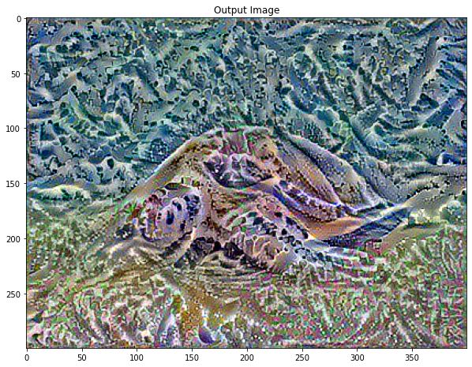
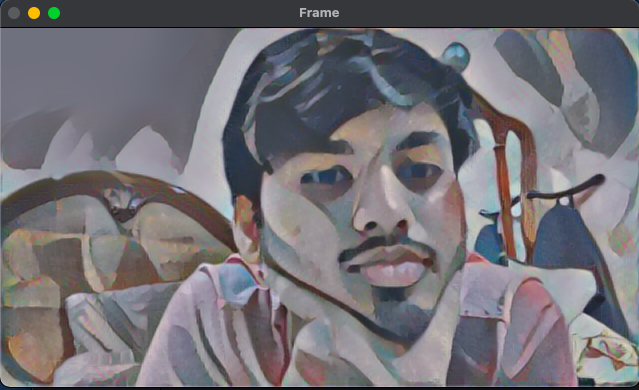
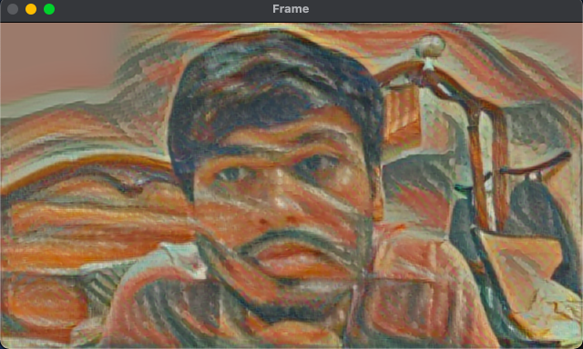
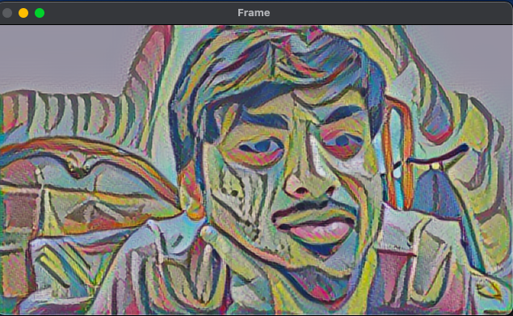

# neural-style-transfer

In this project Neural Style Transfer (NST) is used to style images and videos. The [Neural Style Transfer for images](./neural-style-transfer-for-images.ipynb) is the notebook in which NST is applied on images, the [Neural Style Transfer for videos](./neural-style-transfer-for-videos.ipynb) is the notebook in which NST is applied on videos and [Real time neural style transfer](./real-time-neural-style-transfer.py) is the script which is used style video captured in real time.

## Table of contents

- [Getting started](#getting-started)
- [Neural Style Transfer for images](#neural-style-transfer-for-images)
- [Results for Neural Style Transfer for images](#results-for-neural-style-transfer-for-images)
- [Neural Style Transfer for videos](#neural-style-transfer-for-videos)
- [Real time neural style transfer](#real-time-neural-style-transfer)
- [License](#license)

## Getting started

The [neural-style-transfer-for-images](https://www.kaggle.com/akashsdas/neural-style-transfer-for-images) and [neural-style-transfer-for-videos](https://www.kaggle.com/akashsdas/neural-style-transfer-for-videos) are available on Kaggle to work in the same environment where this notebook was created i.e. use the same version packages used, etc... These notebooks uses **GPU** for faster computation.

The **real-time-neural-style-transfer.py** script can be executed like a normal python script. This script uses one video capture (webcam), so if no webcam is avialable then replace `0` value in `cv2.VideoCapture` method with `video filename` to apply on that video.

## Neural Style Transfer for images

Neural Style Transfer (NST) is one of the most fun techniques in deep learning. It merges two images namely, a `content image (C)` and a `style image (S)`, to create a `generated image (G)`. The generated image G combines the **content** of the image C with the **style** of image S.

For example, let’s take an image of this turtle and Katsushika Hokusai's `The Great Wave off Kanagawa`:

Style transfer is an interesting technique that showcases the capabilities and internal representations of neural networks.

Another example for this is below

For example, let’s take an image of this `dog` and `Wassily Kandinsky's Composition 7`:

[Yellow Labrador Looking](https://commons.wikimedia.org/wiki/File:YellowLabradorLooking_new.jpg), from Wikimedia Commons by [Elf](https://en.wikipedia.org/wiki/User:Elf). License [CC BY-SA 3.0](https://creativecommons.org/licenses/by-sa/3.0/deed.en)

Now how would it look like if Kandinsky decided to paint the picture of this Dog exclusively with this style? Something like this?

## Results for Neural Style Transfer for images

## Neural Style Transfer for videos

This is an naive implementation for applying neural style transfer for videos. Here neural style transfer is applied to every frame of the video and a new video is created with the applied style with the content of the original video. The way I've applied neural style transfer on a frame of the video is the same as we apply on a single image (since an individual frame is just an image).

For this project I've used the pre-trained model from Tensorflow Hub which will allow us to perform Fast Style Transfer, though custom models can be used but applying style to them will be quite time consuming as compared to the method used here.

The styled videos for this project are saved in this Kaggle [kernel](https://www.kaggle.com/akashsdas/neural-style-transfer-for-videos).

## Real time neural style transfer

This one is very **laggay** and the reason for that is that this is a naive implementation where each and every NST is applied on each and every frame and that computation for styling a frame is what causes the lag but this is faster as compared to using custom models as here **Fast Style Transfer** is used.

## Results for real time neural style transfer

## License

[APACHE LICENSE, VERSION 2.0](./LICENSE)
