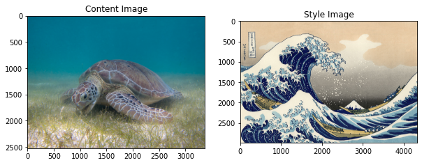
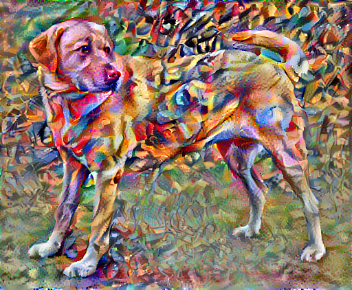
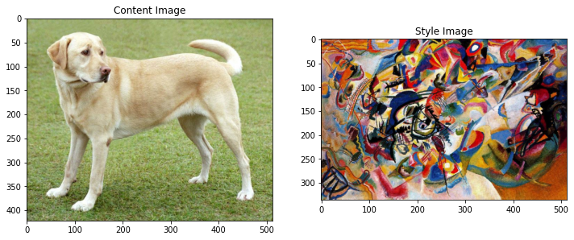

# neural-style-transfer-for-images

Neural Style Transfer (NST) is one of the most fun techniques in deep learning. It merges two images namely, a `content image (C)` and a `style image (S)`, to create a `generated image (G)`. The generated image G combines the **content** of the image C with the **style** of image S.

For example, let’s take an image of this turtle and Katsushika Hokusai's `The Great Wave off Kanagawa`:

Style transfer is an interesting technique that showcases the capabilities and internal representations of neural networks.

Another example for this is below

For example, let’s take an image of this `dog` and `Wassily Kandinsky's Composition 7`:

[Yellow Labrador Looking](https://commons.wikimedia.org/wiki/File:YellowLabradorLooking_new.jpg), from Wikimedia Commons by [Elf](https://en.wikipedia.org/wiki/User:Elf). License [CC BY-SA 3.0](https://creativecommons.org/licenses/by-sa/3.0/deed.en)

Now how would it look like if Kandinsky decided to paint the picture of this Dog exclusively with this style? Something like this?

## Table of contents

- [Getting started](#getting-started)
- [Results](#results)
- [License](#license)

## Getting started

The [notebook](https://www.kaggle.com/akashsdas/neural-style-transfer-for-images) is available on Kaggle to work in the same environment where this notebook was created i.e. use the same version packages used, etc...

## Results

## License

[APACHE LICENSE, VERSION 2.0](./LICENSE)
